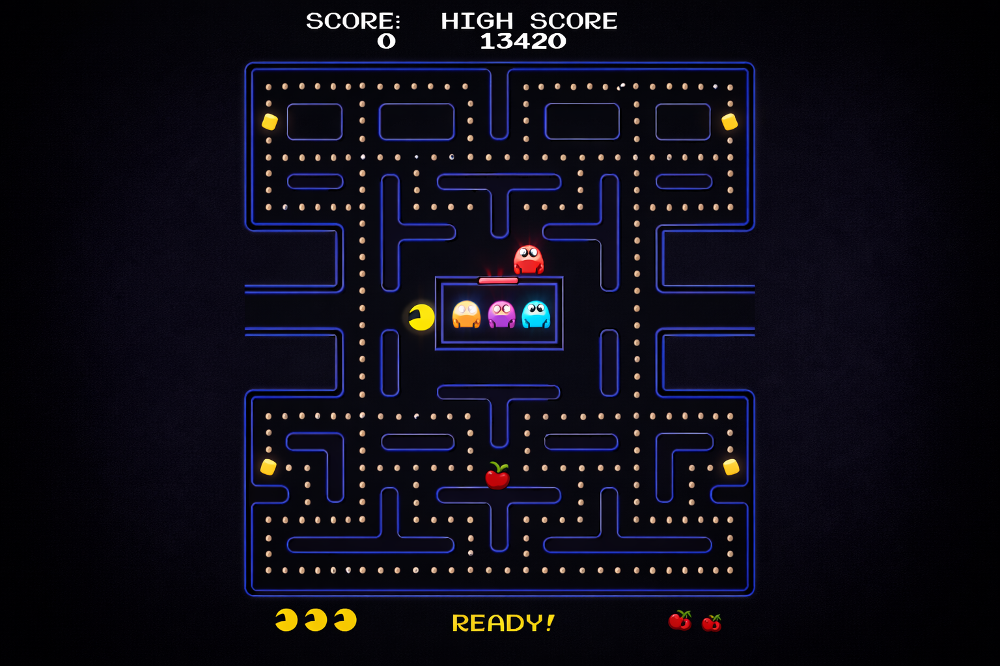

[](http://makeapullrequest.com)


[](https://www.python.org/dev/peps/pep-0008/)


<div align="center">

# CS 451/551: Introduction to Artificial Intelligence

## Spring 2026

### Özyeğin University

</div>

---

---

<div align="center">

# 📚🧭📖 Homework 1: Search — Student Guide



</div>

## 👋 Introduction

In this project, your Pac-Man agent will find paths through his maze world, both to reach a particular location and to
collect food efficiently. You will build general search algorithms and apply them to different Pac-Man scenarios.

The game engine, display system, and test infrastructure are already built for you. **Your job is to implement the
search algorithms and problem formulations that make Pac-Man smart.**

---

## 🧩 Compatibility

This project has been tested and works on **Linux, macOS, and Windows**.

---

## 🔑 Prerequisites

- **Python 3.10+** (no external packages required — only the Python standard library)
- **Tkinter** (usually bundled with Python; needed for the graphical display)
- **pytest** (for running the self-check tests)

> **Linux users:** Tkinter is not bundled with Python on most Linux distributions. Install it before launching the game:
> ```bash
> sudo apt-get install python3-tk        # Debian / Ubuntu
> sudo dnf install python3-tkinter       # Fedora / RHEL
> sudo pacman -S tk                      # Arch
> ```
> The `pytest` tests run fully headless and work **without** Tkinter installed.

To verify your setup, run:

```bash
python main.py
```

You should see a Pac-Man game window open. Use the arrow keys to play manually and confirm everything works.

If you don't have pytest installed:

```bash
pip install pytest
```

---

## 🧬 Project Structure

```
pac-man-search/
├── main.py                        # Entry point — run this to start Pac-Man
│
├── pacman/                        # Main game package
│   ├── search.py                  # TODO — search algorithms (YOU EDIT THIS)
│   ├── search_agents.py           # TODO — search problems & heuristics (YOU EDIT THIS)
│   ├── engine.py                  # Game runner and command-line interface
│   ├── game.py                    # Core game framework (GameState, Agent, Directions, Grid)
│   ├── layout.py                  # Maze loading and parsing from .lay files
│   ├── util.py                    # Data structures: Stack, Queue, PriorityQueue
│   ├── eight_puzzle.py            # 8-puzzle domain (used to test your search algorithms)
│   ├── agents/
│   │   ├── pacman_agents.py       # Pre-built Pac-Man agents (LeftTurnAgent, GreedyAgent)
│   │   ├── ghost_agents.py        # Ghost behavior controllers
│   │   └── keyboard_agents.py     # Human-playable keyboard agent
│   └── display/
│       ├── graphics_display.py    # Tkinter graphical display
│       ├── graphics_utils.py      # Graphics helper utilities
│       └── text_display.py        # Text-only display (no GUI needed)
│
├── layouts/                       # Maze layout files (.lay)
│   ├── tinyMaze.lay
│   ├── smallMaze.lay
│   ├── mediumMaze.lay
│   ├── bigMaze.lay
│   └── ... (37 layouts total)
│
└── tests/
    └── check.py                   # Self-check tests — run with pytest
```

---

## 📃 Files You Should Read (But Not Edit)

<div align="center">

| File                                 | Description                                                                                                                            |
|--------------------------------------|----------------------------------------------------------------------------------------------------------------------------------------|
| `pacman/util.py`                     | Data structures you will use: `Stack`, `Queue`, `PriorityQueue`                                                                        |
| `pacman/game.py`                     | Core game types: `Agent`, `Directions`, `Actions`, `GameState`, `Grid`                                                                 |
| `pacman/search_agents.py` (top half) | `SearchAgent` and `PositionSearchProblem` — read these to understand how search agents work, but only edit the sections marked for you |

</div>

---

## 🗂️ Files You Will Edit

You only need to modify **two files**. All the places where you need to write code are marked with `# TODO` comments.

<div align="center">

| File                      | What You Implement                                 |
|---------------------------|----------------------------------------------------|
| `pacman/search.py`        | Generic search algorithms (DFS, BFS, UCS, A*)      |
| `pacman/search_agents.py` | Search problem definitions and heuristic functions |

</div>

⚠️🚨 **Do not modify any other files.**

### Exact functions and methods to implement

#### `pacman/search.py` — 4 functions

<div align="center">

| Function                            | Question | Description                                                             |
|-------------------------------------|----------|-------------------------------------------------------------------------|
| `depth_first_search(problem)`       | Q1       | DFS graph search — use `util.Stack`                                     |
| `breadth_first_search(problem)`     | Q2       | BFS graph search — use `util.Queue`                                     |
| `uniform_cost_search(problem)`      | Q3       | UCS graph search — use `util.PriorityQueue`, priority = cumulative cost |
| `a_star_search(problem, heuristic)` | Q4       | A\* graph search — priority = g(n) + h(n)                               |

</div>

#### `pacman/search_agents.py` — 7 methods and functions

<div align="center">

| Class / Function                    | Method                                 | Question | Description                                                                          |
|-------------------------------------|----------------------------------------|----------|--------------------------------------------------------------------------------------|
| `CornersProblem`                    | `get_start_state()`                    | Q5       | Return a hashable state encoding Pacman's position + which corners have been visited |
| `CornersProblem`                    | `is_goal_state(state)`                 | Q5       | Return `True` when all four corners have been visited                                |
| `CornersProblem`                    | `get_successors(state)`                | Q5       | Return `(successor, action, 1)` triples with updated corner-visitation info          |
| `corners_heuristic(state, problem)` | _(free function)_                      | Q6       | Admissible & consistent heuristic for `CornersProblem`                               |
| `food_heuristic(state, problem)`    | _(free function)_                      | Q7       | Admissible & consistent heuristic for `FoodSearchProblem`                            |
| `AnyFoodSearchProblem`              | `is_goal_state(state)`                 | Q8       | Return `True` if position `(x, y)` contains food (`self.food[x][y]`)                 |
| `ClosestDotSearchAgent`             | `find_path_to_closest_dot(game_state)` | Q8       | Use a search function on `AnyFoodSearchProblem` to return a path to the nearest dot  |

</div>

## Files You Should Read (But Not Edit)

<div align="center">

| File                                 | Description                                                                                                                            |
|--------------------------------------|----------------------------------------------------------------------------------------------------------------------------------------|
| `pacman/util.py`                     | Data structures you will use: `Stack`, `Queue`, `PriorityQueue`                                                                        |
| `pacman/game.py`                     | Core game types: `Agent`, `Directions`, `Actions`, `GameState`, `Grid`                                                                 |
| `pacman/search_agents.py` (top half) | `SearchAgent` and `PositionSearchProblem` — read these to understand how search agents work, but only edit the sections marked for you |

</div>

---

## 🔧 Installation

### Prerequisites

- Python 3.10 or later
- pip

### Step-by-step

```bash
# 1. Clone the repository
git clone <repo-url>
cd pac-man-search

# 2. Create and activate a virtual environment
python -m venv .venv
source .venv/bin/activate        # Linux / macOS
# .venv\Scripts\activate         # Windows
```

---

## 🚀 Getting Started

### Step 1: Play the Game Manually

```bash
python main.py
```

Use the arrow keys to control Pac-Man. This helps you understand the game mechanics.

### Step 2: Try Different Layouts

```bash
python main.py --layout smallMaze
python main.py --layout mediumMaze
python main.py -l bigMaze
```

### Step 3: Understand the SearchAgent

The `SearchAgent` class (in `search_agents.py`) connects your search algorithms to the Pac-Man game. When the game
starts, it:

1. Creates a **search problem** from the current game state
2. Calls your **search function** to find a solution (a list of actions)
3. Executes those actions one at a time

For example, to run Pac-Man with your DFS implementation:

```bash
python main.py -l tinyMaze -p SearchAgent -a fn=depth_first_search
```

### Step 4: Understand the SearchProblem Interface

Every search problem implements the `SearchProblem` abstract class (defined in `search.py`):

```python
class SearchProblem:
    def get_start_state(self):
        """Returns the start state."""

    def is_goal_state(self, state):
        """Returns True if the state is a goal."""

    def get_successors(self, state):
        """Returns list of (successor_state, action, step_cost) triples."""

    def get_cost_of_actions(self, actions):
        """Returns the total cost of a sequence of actions."""
```

Your search algorithms should work with **any** `SearchProblem`, not just Pac-Man mazes. This is what makes them
generic.

### Step 5: Understand the Provided Data Structures

In `pacman/util.py`, you have ready-to-use data structures:

```python
from pacman import util

stack = util.Stack()  # LIFO — use for DFS
stack.push(item)
item = stack.pop()

queue = util.Queue()  # FIFO — use for BFS
queue.push(item)
item = queue.pop()

pq = util.PriorityQueue()  # Min-heap — use for UCS and A*
pq.push(item, priority)
item = pq.pop()
pq.update(item, priority)  # Update priority if lower

# All three support:
data_structure.is_empty()  # Returns True if empty
```

---

## 📝 Your Tasks (8 Questions — 75 Points Total)

### Question 1: Depth-First Search (9 pts)

**File:** `pacman/search.py` — function `depth_first_search(problem)`

Implement the DFS algorithm using **graph search** (track visited states to avoid revisiting them). Your algorithm
should return a list of actions that leads from the start state to a goal state.

**Key requirements:**

- Use `util.Stack` as your frontier
- Implement **graph search** (not tree search) — keep a set of visited states
- Return a list of actions (e.g., `['South', 'South', 'West', ...]`)

**Try it out:**

```bash
python main.py -l tinyMaze -p SearchAgent
python main.py -l mediumMaze -p SearchAgent
python main.py -l bigMaze -z .5 -p SearchAgent
```

**Hint:** The algorithm pushes `(state, actions_so_far)` tuples onto the stack. When you pop a state, check if it's a
goal. If not, expand its successors and push unvisited ones.

---

### Question 2: Breadth-First Search (9 pts)

**File:** `pacman/search.py` — function `breadth_first_search(problem)`

Implement BFS using **graph search**. BFS explores the shallowest nodes first and is guaranteed to find the shortest
path (fewest actions).

**Key requirements:**

- Use `util.Queue` as your frontier
- Implement graph search

**Try it out:**

```bash
python main.py -l mediumMaze -p SearchAgent -a fn=bfs
python main.py -l bigMaze -p SearchAgent -a fn=bfs -z .5
```

**Note:** If Pac-Man moves too slowly for you, try `--frameTime 0`.

**Important:** Your BFS should also work on the 8-puzzle. The framework includes an `EightPuzzleSearchProblem` in
`eight_puzzle.py` — your generic BFS should solve it without any Pac-Man-specific code.

---

### Question 3: Uniform Cost Search (9 pts)

**File:** `pacman/search.py` — function `uniform_cost_search(problem)`

Implement UCS, which explores nodes in order of their total path cost. Unlike BFS, UCS handles varying step costs.

**Key requirements:**

- Use `util.PriorityQueue` as your frontier (priority = cumulative path cost)
- Implement graph search

**Try it out:**

```bash
python main.py -l mediumMaze -p SearchAgent -a fn=ucs
python main.py -l mediumDottedMaze -p StayEastSearchAgent
python main.py -l mediumScaryMaze -p StayWestSearchAgent
```

The `StayEastSearchAgent` and `StayWestSearchAgent` use cost functions that penalize certain positions. UCS should find
different paths than BFS on these problems.

---

### Question 4: A* Search (9 pts)

**File:** `pacman/search.py` — function `a_star_search(problem, heuristic=null_heuristic)`

Implement A* search. A* is like UCS but uses `f(n) = g(n) + h(n)` as the priority, where:

- `g(n)` = cost to reach node `n` from the start
- `h(n)` = heuristic estimate of the cost from `n` to the goal

**Key requirements:**

- Use `util.PriorityQueue` with priority = `g(n) + h(n)`
- The `heuristic` parameter is a function: `heuristic(state, problem)` returns a number
- When `heuristic=null_heuristic` (returns 0), A* should behave like UCS

**Try it out:**

```bash
python main.py -l bigMaze -z .5 -p SearchAgent -a fn=astar,heuristic=manhattan_heuristic
```

With the Manhattan heuristic, A* should find the optimal path while expanding far fewer nodes than UCS.

---

### Question 5: Corners Problem — State Representation (9 pts)

**File:** `pacman/search_agents.py` — class `CornersProblem`

*Depends on: Question 2 (BFS)*

Now we move beyond simple navigation. In the **corners problem**, Pac-Man must visit all four corners of the maze. You
need to define:

- **State representation:** What information must the state track beyond just Pac-Man's `(x, y)` position? (Hint: you
  need to know which corners have been visited.)
- `get_start_state()` — return the initial state
- `is_goal_state(state)` — return `True` when all four corners have been visited
- `get_successors(state)` — return successors with updated state information

**Key requirements:**

- The state must encode both position and which corners have been visited
- A useful state representation: `(position, visited_corners_tuple)` where `visited_corners_tuple` is a tuple of
  booleans or a tuple of remaining corners
- The state must be **hashable** (tuples are; lists are not)

**Try it out:**

```bash
python main.py -l tinyCorners -p SearchAgent -a fn=bfs,prob=CornersProblem
python main.py -l mediumCorners -p SearchAgent -a fn=bfs,prob=CornersProblem
```

---

### Question 6: Corners Problem — Heuristic (9 pts)

**File:** `pacman/search_agents.py` — function `corners_heuristic(state, problem)`

*Depends on: Question 4 (A\*)*

Write a **consistent** heuristic for the `CornersProblem`. A good heuristic will dramatically reduce the number of nodes
A* needs to expand.

**Key requirements:**

- Must be **admissible**: never overestimate the true cost to reach all remaining corners
- Must be **consistent**: `h(n) <= cost(n, n') + h(n')` for every successor `n'`
- The trivial heuristic (returning 0) is admissible and consistent but won't reduce node expansions

**Grading (partial credit):**

<div align="center">

| Nodes Expanded on `mediumCorners` | Points |
|-----------------------------------|--------|
| More than 2000                    | 0/9    |
| At most 2000                      | 3/9    |
| At most 1600                      | 6/9    |
| At most 1200                      | 9/9    |

</div>

**Hint:** Think about the Manhattan distance to the farthest unvisited corner, or the total Manhattan distance of a
greedy tour through all unvisited corners.

**Try it out:**

```bash
python main.py -l mediumCorners -p AStarCornersAgent -z 0.5
```

---

### Question 7: Eating All the Dots — Food Heuristic (12 pts)

**File:** `pacman/search_agents.py` — function `food_heuristic(state, problem)`

*Depends on: Question 4 (A\*)*

Write a consistent heuristic for the `FoodSearchProblem`, where Pac-Man must eat all food pellets. The state is a tuple
`(pacman_position, food_grid)` where `food_grid` is a `Grid` of booleans.

**Key requirements:**

- Must be **admissible** and **consistent**
- Use `problem.heuristic_info` dictionary to cache computed values across calls
- You can call `food_grid.as_list()` to get a list of `(x, y)` food positions
- The helper `maze_distance(point1, point2, game_state)` computes true maze distance (uses your BFS)

**Grading (partial credit):**

<div align="center">

| Nodes Expanded on `trickySearch` | Points |
|----------------------------------|--------|
| More than 15000                  | 3/12   |
| At most 15000                    | 6/12   |
| At most 12000                    | 9/12   |
| At most 7000                     | 12/12  |

</div>

Your heuristic must also be admissible to receive any credit.

**Hint:** The maximum `maze_distance` from Pac-Man's position to any single food pellet is admissible. Can you do
better?

**Try it out:**

```bash
python main.py -l trickySearch -p AStarFoodSearchAgent
```

---

### Question 8: Suboptimal Search — Closest Dot (9 pts)

**File:** `pacman/search_agents.py` — two pieces:

1. `ClosestDotSearchAgent.find_path_to_closest_dot(game_state)` — use any search function to find a path to the nearest
   food dot
2. `AnyFoodSearchProblem.is_goal_state(state)` — return `True` if the given `(x, y)` position contains food

The `ClosestDotSearchAgent` uses a greedy strategy: repeatedly find and eat the closest dot. This won't always find the
globally optimal solution, but it's fast.

**Key requirements:**

- `is_goal_state` should check `self.food[x][y]` (the food grid stored during initialization)
- `find_path_to_closest_dot` should create an `AnyFoodSearchProblem` and call a search function (BFS is a natural
  choice)

**Try it out:**

```bash
python main.py -l bigSearch -p ClosestDotSearchAgent -z .5
```

---

## 🧐 Testing Your Implementation

### Running the Self-Check Tests

The file `tests/check.py` contains **45 tests** covering all 8 questions. Run them with pytest to see detailed pass/fail
output for every part of your implementation.

**Run all tests:**

```bash
pytest tests/check.py -v
```

**Run tests for a specific question:**

```bash
pytest tests/check.py -v -k "q1"     # Q1: Depth-First Search
pytest tests/check.py -v -k "q2"     # Q2: Breadth-First Search
pytest tests/check.py -v -k "q3"     # Q3: Uniform Cost Search
pytest tests/check.py -v -k "q4"     # Q4: A* Search
pytest tests/check.py -v -k "q5"     # Q5: Corners Problem
pytest tests/check.py -v -k "q6"     # Q6: Corners Heuristic
pytest tests/check.py -v -k "q7"     # Q7: Food Heuristic
pytest tests/check.py -v -k "q8"     # Q8: Closest Dot
```

**Run a single test by name:**

```bash
pytest tests/check.py -v -k "test_q1_pacman_tiny_maze"
```

### Understanding the Test Output

When you run the tests, you will see output like this:

```
tests/check.py::TestQ1_DepthFirstSearch::test_q1_returns_list        PASSED
tests/check.py::TestQ1_DepthFirstSearch::test_q1_simple_path         PASSED
tests/check.py::TestQ1_DepthFirstSearch::test_q1_graph_backtrack     PASSED
tests/check.py::TestQ1_DepthFirstSearch::test_q1_handles_cycles      PASSED
tests/check.py::TestQ1_DepthFirstSearch::test_q1_start_is_goal       PASSED
tests/check.py::TestQ1_DepthFirstSearch::test_q1_pacman_tiny_maze    PASSED
```

- **PASSED** — Your implementation is correct for this test case.
- **FAILED** — Something is wrong. Read the error message for details. For example:
    - `SystemExit: 1` — You haven't implemented the function yet (the `# TODO` stub calls `raise_not_defined()`).
    - `AssertionError: BFS should find the 2-step path, got 3 steps` — Your algorithm found a path, but not the optimal
      one.
    - `TypeError: unhashable type: 'list'` — Your state contains a list instead of a tuple.

### What Each Test Checks

**Q1–Q4 (Search Algorithms):** Each has 6 tests:

<div align="center">

| Test                                                                   | What It Verifies                                             |
|------------------------------------------------------------------------|--------------------------------------------------------------|
| `returns_list`                                                         | Your function returns a `list`, not `None` or something else |
| `simple_path` / `finds_shortest_path` / `cheapest_not_shortest`        | Correct result on a small graph                              |
| `graph_backtrack` / `bfs_vs_dfs` / `weighted_graph` / `with_heuristic` | Algorithm-specific behavior                                  |
| `handles_cycles`                                                       | Graph search (visited set) prevents infinite loops           |
| `start_is_goal`                                                        | Edge case: returns `[]` when start state is already the goal |
| `pacman_tiny_maze`                                                     | Runs on an actual Pac-Man maze layout                        |

</div>

**Q5 (Corners Problem):** 5 tests:

<div align="center">

| Test                        | What It Verifies                                                   |
|-----------------------------|--------------------------------------------------------------------|
| `get_start_state`           | Returns a non-None, hashable state                                 |
| `start_not_goal`            | Start is not a goal (corners not yet visited)                      |
| `get_successors`            | Returns valid `(state, action, cost)` triples with hashable states |
| `tiny_corners`              | BFS solves tinyCorners in exactly 28 steps (optimal)               |
| `successor_updates_corners` | State correctly tracks which corners have been visited             |

</div>

**Q6 (Corners Heuristic):** 6 tests:

<div align="center">

| Test                         | What It Verifies                                     |
|------------------------------|------------------------------------------------------|
| `heuristic_returns_number`   | Returns a non-negative `int` or `float`              |
| `heuristic_nonzero_at_start` | Non-trivial (> 0) when corners remain                |
| `admissibility`              | `h(state) <= true_optimal_cost`                      |
| `consistency`                | `h(n) - h(n') <= step_cost` for each successor       |
| `goal_heuristic_zero`        | `h(goal) == 0`                                       |
| `medium_corners`             | Runs A* on mediumCorners and reports your grade tier |

</div>

**Q7 (Food Heuristic):** 5 tests:

<div align="center">

| Test                       | What It Verifies                                    |
|----------------------------|-----------------------------------------------------|
| `heuristic_returns_number` | Returns a non-negative number                       |
| `goal_heuristic_zero`      | `h == 0` when no food remains                       |
| `admissibility`            | `h(state) <= true_optimal_cost`                     |
| `consistency`              | `h(n) - h(n') <= step_cost`                         |
| `tricky_search`            | Runs A* on trickySearch and reports your grade tier |

</div>

**Q8 (Closest Dot):** 5 tests:

<div align="center">

| Test                        | What It Verifies                                   |
|-----------------------------|----------------------------------------------------|
| `any_food_goal_at_food`     | `is_goal_state` returns `True` at food positions   |
| `any_food_no_food_not_goal` | `is_goal_state` returns `False` at empty positions |
| `find_closest_dot_simple`   | Finds a path of correct length to the nearest dot  |
| `find_closest_dot_farther`  | Works when the nearest dot is several steps away   |
| `full_agent`                | The full `ClosestDotSearchAgent` collects all food |

</div>

### Grading Feedback for Heuristics

For Q6 and Q7, the tests print your **grade tier** based on how many nodes your heuristic causes A* to expand:

```
tests/check.py::TestQ6_CornersHeuristic::test_q6_medium_corners PASSED
  [Q6] mediumCorners: expanded 1100 nodes → 9/9

tests/check.py::TestQ7_FoodHeuristic::test_q7_tricky_search PASSED
  [Q7] trickySearch: expanded 6800 nodes → 12/12
```

Use this to iteratively improve your heuristic.

--- 

### Suggested Workflow

1. **Start with Q1** — implement DFS and run:
   ```bash
   pytest tests/check.py -v -k "q1"
   ```
2. **Move to Q2–Q4** — each builds on the same graph search pattern.
3. **Q5 depends on Q2** — you need a working BFS to test the corners problem.
4. **Q6–Q7 depend on Q4** — you need a working A* to test heuristics.
5. **Q8 is independent** — you can do it anytime after Q1–Q4.

After each question, run the tests to confirm everything passes before moving on.

---

## 📟 Useful Command-Line Options

```bash
python main.py --help                # Show all options

# Layout selection
python main.py -l smallMaze          # Use a specific maze layout

# Agent selection
python main.py -p SearchAgent        # Use the search agent (default: DFS)
python main.py -p SearchAgent -a fn=bfs                     # Use BFS
python main.py -p SearchAgent -a fn=ucs                     # Use UCS
python main.py -p SearchAgent -a fn=astar,heuristic=manhattan_heuristic  # A* with heuristic

# Problem selection
python main.py -p SearchAgent -a fn=bfs,prob=CornersProblem  # Corners problem
python main.py -p AStarCornersAgent                          # A* on corners
python main.py -p AStarFoodSearchAgent                       # A* on food search

# Display options
python main.py --frameTime 0         # Instant moves (no animation delay)
python main.py -z 0.5                # Zoom out for large mazes
python main.py -q                    # Quiet mode (no graphics)
python main.py --textGraphics        # Text-only display (no Tkinter needed)
```

---

## 💡 General Algorithm Hints

### Graph Search Pattern

All four search algorithms (DFS, BFS, UCS, A*) follow the same general pattern:

```
1. Initialize the frontier with the start state
2. Initialize an empty set of visited states
3. While the frontier is not empty:
   a. Pop a node from the frontier
   b. If this node is the goal, return the path
   c. If this node has been visited, skip it
   d. Mark this node as visited
   e. For each successor of this node:
      - If the successor has not been visited, add it to the frontier
4. Return failure (no path found)
```

The **only difference** between DFS, BFS, UCS, and A* is the data structure used for the frontier and how priorities are
assigned:

<div align="center">

| Algorithm | Frontier        | Priority                    |
|-----------|-----------------|-----------------------------|
| DFS       | `Stack`         | Last in, first out          |
| BFS       | `Queue`         | First in, first out         |
| UCS       | `PriorityQueue` | Cumulative path cost `g(n)` |
| A*        | `PriorityQueue` | `g(n) + h(n)`               |

</div>

### Common Mistakes to Avoid

- **Tree search instead of graph search:** Always track visited states. Without this, your algorithm may loop forever on
  graphs with cycles.
- **Checking goal at push time vs. pop time:** Check the goal state when you **pop** a node from the frontier, not when
  you push it. This is important for UCS and A* correctness.
- **Mutable state in tuples:** If your state includes a list, convert it to a tuple before adding to the visited set (
  lists are not hashable).
- **Forgetting to track the path:** Each entry in the frontier should include the sequence of actions taken to reach
  that state.

---

## 🛠️ Troubleshooting

### "Method not implemented" / `SystemExit: 1`

This means you haven't filled in the `# TODO` section yet. The stub functions call `util.raise_not_defined()`, which
prints a message and exits. Replace the `util.raise_not_defined()` call with your implementation.

### `TypeError: unhashable type: 'list'`

Your state representation uses a **list** somewhere. States must be fully hashable so they can be added to Python sets
and used as dictionary keys. Convert lists to **tuples**:

```python
# Wrong — lists are not hashable
state = (position, [True, False, True, False])

# Correct — tuples are hashable
state = (position, (True, False, True, False))
```

### "Path goes through a wall"

Your `get_successors()` method is generating invalid moves. Make sure you check `self.walls[next_x][next_y]` before
adding a successor.

### Tests pass for Q1–Q4 but Q5 fails

Q5 (CornersProblem) depends on Q2 (BFS). Make sure your BFS is working correctly first. Run:

```bash
pytest tests/check.py -v -k "q2"
```

### Q6/Q7 tests pass but with low grade tier

Your heuristic is correct (admissible and consistent) but not strong enough. A stronger heuristic estimates the true
cost more closely, causing A* to expand fewer nodes. Try:

- **Q6:** Instead of just the distance to the farthest corner, estimate the total tour distance through all unvisited
  corners.
- **Q7:** Instead of distance to the farthest food, consider the distance between the two food pellets that are farthest
  apart from each other.

### Pac-Man moves but doesn't reach the goal

Your search algorithm is returning a path, but the path doesn't end at a goal state. Make sure you check
`problem.is_goal_state(state)` when **popping** from the frontier, not when pushing.

### "No graphics" / Tkinter errors

If you're running on a remote server or don't have Tkinter:

```bash
python main.py -q                    # No graphics at all
python main.py --textGraphics        # Text-only display
```

The pytest tests in `tests/check.py` never require graphics — they always work headless.

### Tests hang or run forever

Your search algorithm likely has an infinite loop. This usually means you're doing **tree search** instead of **graph
search** — you're not tracking visited states, so the algorithm keeps revisiting the same states. Add a `visited` set
and skip states you've already expanded.

---

## 💯 Points Breakdown

<div align="center">

| Question          | Topic                            | Points  |
|-------------------|----------------------------------|---------|
| Q1                | Depth-First Search               | 9       |
| Q2                | Breadth-First Search             | 9       |
| Q3                | Uniform Cost Search              | 9       |
| Q4                | A* Search                        | 9       |
| Q5                | Corners Problem (representation) | 9       |
| Q6                | Corners Heuristic                | 9       |
| Q7                | Food Search Heuristic            | 12      |
| Q8                | Closest Dot Search               | 9       |
| **Code Subtotal** |                                  | **75**  |
| Report            | Written report                   | 25      |
| **Total**         |                                  | **100** |

</div>

---

## Academic Integrity

- Do **not** distribute or publish solutions
- Do **not** copy solutions from the internet
- You **may** discuss general approaches with classmates, but write your own code

---

## 🔁 Changes from Original

This project is based on the [UC Berkeley CS 188 Pac-Man AI Projects](http://ai.berkeley.edu). The following
modifications were made by **Amin D. Alamdari** (amin.alamdari@ozu.edu.tr):

- **Project restructuring:** Reorganized into a proper Python package layout (`pacman/`, `grader/`, `tests/`)
- **Modernized packaging:** Added `main.py` entry point and modular imports replacing the original flat file structure
- **Updated assignment scaffolding:** Replaced `*** YOUR CODE HERE ***` markers with descriptive `# TODO` comments
- **Unit test suite:** Added `tests/` directory with pytest-based tests for core modules
- **Documentation rewrite:** Rewrote README with structured task descriptions, algorithm hints, and grading rubric
- **Code style:** Renamed functions to `snake_case` convention throughout the codebase

---

## 🤝 Attribution

This project is based on the **UC Berkeley CS 188 Pac-Man AI Projects**.
Original authors: John DeNero (denero@cs.berkeley.edu) and Dan Klein (klein@cs.berkeley.edu).
[CS 188 Project 1: Search](https://inst.eecs.berkeley.edu/~cs188/su25/projects/proj1/)

Modified and extended by Amin D. Alamdari (amin.alamdari@ozu.edu.tr), 2026.

---

## 🔗 Useful Links

- [Project 1: Search](https://inst.eecs.berkeley.edu/~cs188/su25/projects/proj1/)
- [1. Search](https://inst.eecs.berkeley.edu/~cs188/textbook/search/)
  - [1.1 Agents](https://inst.eecs.berkeley.edu/~cs188/textbook/search/agents.html)
  - [1.2 State Spaces and Search Problems](https://inst.eecs.berkeley.edu/~cs188/textbook/search/state.html)
  - [1.3 Uninformed Search](https://inst.eecs.berkeley.edu/~cs188/textbook/search/uninformed.html)
  - [1.4 Informed Search](https://inst.eecs.berkeley.edu/~cs188/textbook/search/informed.html)
- [COMPSCI 188 - 2018-08-28 - Uninformed Search](https://youtu.be/-Xx0QSFYfIQ?si=_bF2GwypXfw_f2eI)
- [COMPSCI 188 - 2018-08-30 - A* Search and Heuristics](https://youtu.be/Mlwrx7hbKPs?si=D_bvBKSz4auKd5O7)
- 